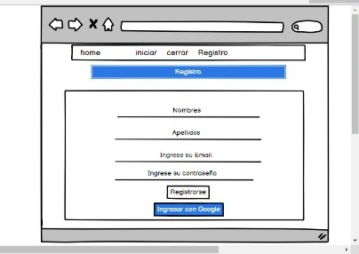
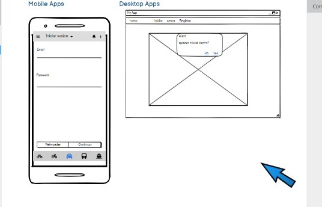
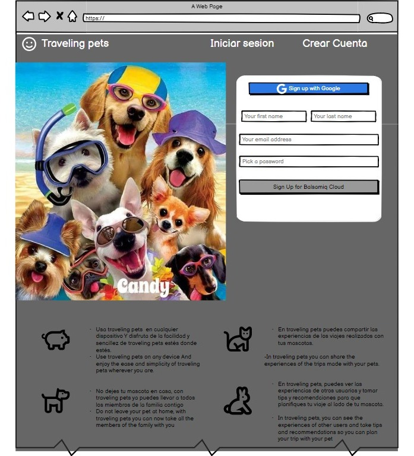

# Creando una Red Social

## Índice
* [0. Definicion del Producto](#0-historias-de-usuario)
* [1. Hitorias de Usuario](#1-historias-de-usuario)
* [2. Prototipo de Baja Fidelidad](#2-Prototipo-de-Baja-Fidelidad)
* [3. Prototipo de Alta Fidelidad](#3-Prototipo-de-Alta-Fidelidad)
* [4.Resumen del Proyecto](#4-Resumen-del-Proyecto)
* [5. Pruebas Unitarias](#5-Pruebas-Unitarias)

## 0. Definición del producto

Nuestros principales usuarios, son aquellos que cuentan con la compania de mascotas y que adicional quieren realizar viajes con ellos, con el fin de dar a conocer los lugares que permitan el ingreso de las mascotas y que tambien cuenten con los espacios necesarios para que ellos puedan interactuar. 

Dentro del desarrollo de nuestro proyecto identificamos mediantes los testeos de usabilidad, que los usuarios, tambien tenian la necesidad de poder compartir las aventuras llevada a cabo con sus mascotas y dar a conocer sus experiencias tanto negativas como positivas del lugar recomendado. 

## 1. Historias de Usuario

HISTORIA 1

-Crear cuenta:
Como: usuario de Traveling Pets
Quiero: crear cuenta.
Para: lograr acceder al contenido que existe en la plataforma.

-Validacion del usuario
Como: usuario de Traveling Pets
Quiero: realizar la validacion de usuario
Para: saber si existe o no una cuenta activa en la plataforma; si existe una cuenta no olverla a crear y si no crearla

-Personalizacion perfil del usuario
Como: usuario de Traveling Pets
Quiero: realizar la personalizacion sobre el perfil del usuario
Para: que el usuario tenga completa libertad acerca de su perfil, ueda actualizar su nombre su foto u ortos aspectos quue sea de su agrado.

-Likear contenido de otros
Como: usuario de Traveling Pets
Quiero: poder likear el contenido de otros
Para: que el otro usuario logre saber que su contenido es de mi interes o esbastantebueno e informativo.

HISTORIA 2:

-Visualizar contenido de otros
Como: usuario de Traveling Pets
Quiero: visualizar el contenido de otros usuarios en a aplicacion 
Para: interatuar con ellos, ver sus opiniones, recomendaciones que realizen, para tener en cuenta de como es ese lugar del que publica, si tratan bien o no a los animalitos, si iene libertad en ese luga o no. entre otros aspectos. 

-Editar contenido
Como: usuario de Traveling Pets
Quiero: editar contenido o actualizar contenido
Para: en caso de querer actualizar algo en su contenido publicado pueda hacerlo sin ninuna restrinccion. 

-Crear contenido:
Como: usuario de Traveling Pets
Quiero: crear nuevo contenido
Para: no solo visualizar el contenido predeterminado que depronto la plataforma ofrezca o solo visualizar el contenido de otros, sino tambien yo visualzar mi contenido y que otros tambien puedan visualizar mi contenido.

HISTORIA 3:

-Borrar contenido
Como: usuario de Traveling Pets
Quiero: borrar contenido que ya no quiera que se visualice mas
Para: tener una mayor comodidad el usuario, no tener un poco de contenido que ya no se quiera compartir.

-Guardar contenido:
Como: usuario de Traveling Pets
Quiero: guardar contenido
Para: tener de una forma más rapida para acceder a informacion que hayamos visualizado y que sea de nuestro interes.

Cerrar sesion:
Como: usuario de Traveling Pets
Quiero: cera sesion.
Para: tener mayor manejo de nuestra cuenta, ya que no siempre queremos tener nuestras sesiones abiertas sea por gusto o por seguridad.

## 2. Prototipo de Baja Fidelidad

  
  

## 3. Prototipo de Alta Fidelidad

  

## 4. Resumen del Proyecto

En este proyecto se construyo una  Red Social, mediante la cual, los usuarios puedan compartir sus anecdotas, tips y recomendaciones de los viajes realizados en compania de sus mascotas.

adicional nuestros usuarios pueden crear su cuenta de usuario, y loguearse con ella; ademas de crear, editar, borrar y "likear" las publicacciones.
 

## 5. Pruebas Unitarias (unit tests)

* Los tests unitarios cubren con el 61% de statements, el 72.72% functions, de 51.53% lines, y de 100% branches, asi;
  

  

